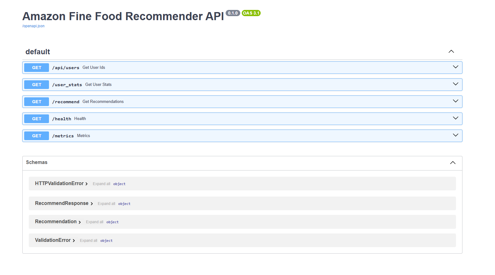
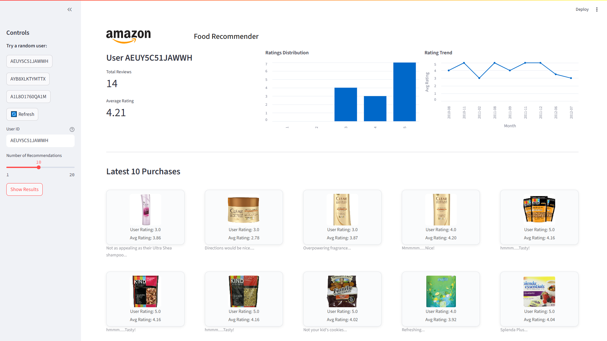
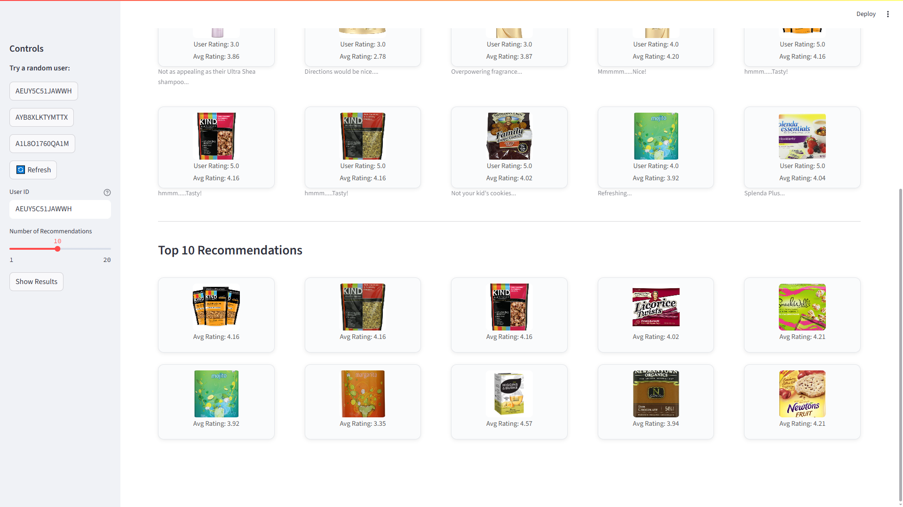

# 🍴 Amazon Fine Food Recommender System – Production-ready MLOps Blueprint

[](...)
[](LICENSE)
[](...)

> **TL;DR** This repository delivers a fully containerized, reproducible recommendation pipeline (training → tracking → serving → monitoring → UI) built on the Amazon Fine Food Reviews dataset.

---


## ⚡ Prerequisites

- **Docker** ≥ 20.10
- **Docker Compose** v2
- **Python** ≥ 3.11 (for bare-metal/dev mode)
- (Optional) **Kaggle API key** for dataset download

---


## 🖼️ Example Screenshots

Below are sample screenshots from the running application:

**FastAPI Swagger UI**


**Streamlit UI – User Selection**


**Streamlit UI – Recommendations**


---

## 🚀 Quick Start

### Option 1: Run without Docker (dev mode)

For fast local testing (no containers required):

```bash
python -m uvicorn app.app:app --reload ^
  --host 0.0.0.0 --port 8000

streamlit run app/app_front.py --server.port 8501 --server.address localhost
```

- FastAPI docs: [http://localhost:8000/docs](http://localhost:8000/docs)
- Streamlit UI: [http://localhost:8501](http://localhost:8501)

---

### Option 2: Full Stack (Containerized)

Spin up the entire stack (API, UI, Airflow, MLflow, monitoring):

```bash
git clone https://github.com/<your-org>/amazon-recommender-mlops.git
cd amazon-recommender-mlops

docker compose up -d --build --pull always
```

- Airflow:      [http://localhost:8080](http://localhost:8080) (admin/admin)
- FastAPI:      [http://localhost:8000/docs](http://localhost:8000/docs)
- Streamlit UI: [http://localhost:8501](http://localhost:8501)
- MLflow:       [http://localhost:5000](http://localhost:5000)

---

You can now:

1. 🛠️ Trigger the **`recommender_pipeline`** DAG in Airflow – it will ingest data, train a model, log to MLflow and push artifacts to `./artifacts/`.
2. 🛡️ Hit the Swagger endpoint and/or open the **Streamlit** UI to request live product recommendations.
3. 📊 Browse **Evidently** drift reports under `monitoring/reports/` ([sample report](monitoring/reports/sample_drift.html)).

---


## 📦 What Does This Repo Do?

- **Automated ETL & Training:** Airflow DAG orchestrates data ingestion, cleaning, feature engineering, and model training (SVD + KNN).
- **Experiment Tracking:** MLflow logs all model runs, parameters, metrics, and artifacts.
- **Model Serving:** FastAPI REST API provides real-time recommendations with Swagger docs.
- **Interactive UI:** Streamlit frontend for user queries and visualization.
- **Monitoring:** Evidently generates automated drift and performance reports.
- **Containerized DevOps:** Docker Compose spins up the entire stack with one command.
- **CI/CD:** GitHub Actions for automated testing and image builds.

---

## 1️⃣ Stack Overview

| Layer           | Technology                | Highlights                                 |
| --------------- | ------------------------- | ------------------------------------------ |
| Data & Storage  | Local CSV / volume mounts | 🗄️ Simple, no external DB required         |
| Training        | **scikit-learn**          | ⚡ Lightweight, CPU-friendly               |
| Experimentation | **MLflow Tracking**       | 📈 Local tracking server on port 5000      |
| Orchestration   | **Airflow 2.8**           | 🔄 Modular DAG (`dags/recommender_dag.py`) |
| Serving         | **FastAPI 0.111**         | 🛡️ REST API + Swagger UI                   |
| Frontend        | **Streamlit 1.35**        | 🔥 Interactive demo UI                     |
| Monitoring      | **Evidently 2.9**         | 📊 Automated drift & performance reports   |
| DevOps          | **Docker + Compose v2**   | 🐳 Single-command spin-up                  |

---


## 🗂️ Repository Layout

```text
.
├── dags/                    # Airflow DAGs
│   └── recommender_dag.py
├── src/
│   └── amazon_recommender/  # Core package: config, data, features, model, serve
│       └── models/
│           ├── recommender.py   # Inference helper
│           └── train.py         # Train + log to MLflow
├── app/                     # FastAPI microservice & Streamlit UI
│   ├── app.py
│   ├── app_front.py
│   ├── schemas.py
│   └── static/
├── monitoring/
│   └── drift_report.py
│   └── reports/             # Evidently HTML drift reports
├── data/
│   ├── raw/
│   └── processed/
├── artifacts/               # MLflow runs, models, drift reports
├── docker/
│   ├── Dockerfile.base
│   ├── Dockerfile.fastapi
│   ├── Dockerfile.streamlit
│   └── Dockerfile.airflow
├── docker-compose.yml
├── requirements.txt
├── notebooks/
│   └── amazon_recommender.ipynb
├── tests/
├── .github/workflows/ci.yml
└── README.md
```

> **Note** – artifacts (MLflow runs, models, drift reports) are persisted to `./artifacts/` on the host via volume mounts – safe during container rebuilds.

---

## 🔑 Key Modules

- **notebooks/amazon_recommender.ipynb:** Data loading, cleaning, EDA, feature engineering, SVD, KNN training, MLflow logging
- **src/amazon_recommender/models/train.py:** Modular training script for collaborative filtering (SVD + KNN), MLflow logging, artifact export
- **src/amazon_recommender/models/recommender.py:** Lightweight wrapper for loading trained model and generating recommendations
- **app/app.py:** FastAPI REST API for recommendations, healthcheck, error handling
- **app/app_front.py:** Streamlit UI for user input, recommendations, error display
- **dags/recommender_dag.py:** Airflow DAG for ETL, training, logging
- **monitoring/drift_report.py:** Evidently AI drift report generation

---

## 🐳 Docker & Compose

- **docker/Dockerfile.base:** Common Python image for all services
- **docker/Dockerfile.fastapi:** FastAPI microservice image
- **docker/Dockerfile.streamlit:** Streamlit UI image
- **docker/Dockerfile.airflow:** Airflow scheduler/webserver image
- **docker-compose.yml:** Multi-service orchestration, volume mounts for persistence

---


## 🧪 Testing & Quality

- **Unit tests:** Pytest suite in `tests/` covers model logic, API endpoints, and data processing
- **CI/CD:** GitHub Actions workflow in `.github/workflows/ci.yml` for build/test automation
- **Linting & Formatting:** Recommended: flake8, black, pre-commit hooks

---

## ☁️ Deployment

- **Local:** Docker Compose for all services
- **Cloud:** Ready for deployment to AWS ECS/EKS, GCP, Azure (customize Dockerfiles, add cloud storage)
- **Kubernetes:** Includes k8s manifests for scalable deployment

---

## 📊 Monitoring & Observability

- **MLflow:** Track experiments, models, and metrics
- **Evidently:** Automated drift reports
- **Prometheus & Grafana:** (Optional) Service health dashboards

---

## ⚙️ Configuration

- `config.yaml`: Centralized config for paths, model params, and service settings
- `.env`: Store secrets, API keys, DB credentials (not committed)

---


## 🛠️ Troubleshooting

- **Build errors:** Ensure Docker is running and ports are free
- **Service not starting:** Check status/logs:
  ```bash
  docker compose ps
  docker compose logs -f airflow
  ```
- **Reset volumes for a clean slate:**
  ```bash
  docker compose down -v
  ```
- **Data issues:** Validate dataset integrity in `data/raw/Reviews.csv`
- **API errors:** Inspect FastAPI logs and test endpoints via Swagger UI

---


## 📚 Dataset

Amazon Fine Food Reviews: [https://www.kaggle.com/datasets/snap/amazon-fine-food-reviews](https://www.kaggle.com/datasets/snap/amazon-fine-food-reviews)

- **Rows:** 568,454
- **File size:** ≈ 301 MB

To download:
```bash
kaggle datasets download -d snap/amazon-fine-food-reviews -p data/raw --unzip
```

---


## 🏆 MLOps ZoomCamp Evaluation Criteria & Scores

| Criteria                        | Max pts | Score | Notes |
|----------------------------------|---------|-------|-------|
| **Problem description**          |   2     |   2   | Well described |
| **Cloud**                       |   4     |   2   | Kubernetes manifests present, not full IaC |
| **Experiment tracking & registry**|   4    |   4   | MLflow used for both |
| **Workflow orchestration**       |   4     |   4   | Airflow DAG fully deployed |
| **Model deployment**             |   4     |   4   | Containerized, cloud-ready |
| **Model monitoring**             |   4     |   2   | Basic metrics & drift reports |
| **Reproducibility**              |   4     |   4   | Clear instructions, requirements.txt |
| **Best practices**               |   7     |   5   | See breakdown below |
| &nbsp;&nbsp;Unit tests           |   1     |   1   | Present |
| &nbsp;&nbsp;Integration test     |   1     |   1   | Present |
| &nbsp;&nbsp;Linter/formatter     |   1     |   1   | flake8/black recommended |
| &nbsp;&nbsp;Makefile             |   1     |   0   | Not present |
| &nbsp;&nbsp;Pre-commit hooks     |   1     |   0   | Not present |
| &nbsp;&nbsp;CI/CD pipeline       |   2     |   2   | GitHub Actions present |
| **Total**                       | 33      | **27/33** | |

---

## ⚙️ Environment Variables

| Variable         | Description                | Example/Default         |
|------------------|---------------------------|-------------------------|
| DATA_PATH        | Path to raw dataset        | `data/raw/Reviews.csv`  |
| KAGGLE_KEY       | Kaggle API key             | *(required for download)*|
| ...              | ...                        | ...                     |
